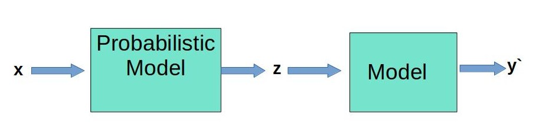

# probablistic_memory_retrieval
A proof of concept in probabilistic retrival of memory using neural networks.

Read More [Probabilistic Memory Retrieval](https://gananath.github.io/prob_retrieval.html)


# Result
- Trained: **3 Epochs**
- Training Accuracy: **74%**
- Testing Accuracy: **73%**

```
@misc{gananath2016,
  author = {Gananath, R.},
  title = {Probablistic Memory Retrieval},
  year = {2022},
  publisher = {GitHub},
  journal = {GitHub repository},
  howpublished = {\url{https://github.com/Gananath/probablistic_memory_retrieval}},
  doi = {10.5281/zenodo.5907674}
}
```
